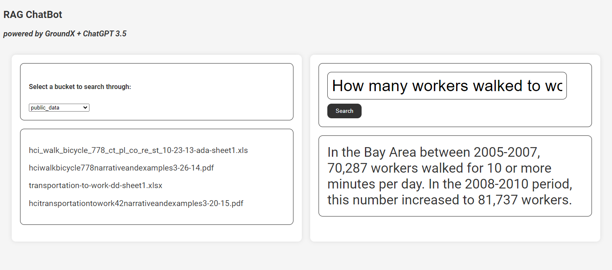

# Node.js RAG ChatBot powered by GroundX and ChatGPT

## Introduction
This is a simple chatbot intended for tutorial purposes. This chatbot, built with Node.js, uses the Retrieval Augmented Generation (RAG) methodology to generate responses based on your ingested data. We use GroundX to search through ingested data and then pass on the query results to ChatGPT to generate a response. 

The significance of using GroundX lies in its data ingestion process and its search and retrieval capabilities.

Through its ingestion process, GroundX extracts data from a wide variety of content and recognizes all sorts of document structures such as tables or page numbers, it generates document and section summaries to preserve the context of your content and can add custom data to help maintain the context of your content, improve search results, or even special notes or tags that can indicate how to handle the content.

GroundX conducts a semantic search on the ingested data and its extra search data, outperforming mainstream vectorized searches. The search API retrieves intelligible text chunks that are then rewritten by GroundX's internal LLM to generate a more natural response that includes document context and extra search data. GroundX combines these automatically generated texts into a single element in the search response so that it can be easily passed on to the LLM of your choice.

## Pre-requisites
- [Node.js](https://nodejs.org/en/download/)
- [GroundX API key](https://documentation.groundx.ai/docs/quick-start)
- [OpenAI API key](https://platform.openai.com/docs/quickstart)


## Installation
1. Copy the repository into your local machine.
2. From your terminal, install the required Node.js packages by running:
   ```bash
   npm install
   ```
3. Create a `.env` file in the root directory of the project and add the following:
   ```
    GROUNDX_API_KEY=<your_groundx_api_key>
    OPENAI_API_KEY=<your_openai_api_key>
    ```

## Usage
1. Run the server by running:
   ```bash
   node server.js
   ```
2. Open your web browser and go to `http://localhost:3000/`
3. In your web browser, select a bucket you want to search through.
4. Type in your query and press enter to receive a response.

_Your web browser should look like the image below:_
<div align="center">


_Screenshot of the RAG ChatBot_

</div>

## More resources
- [GroundX documentation](https://documentation.groundx.ai/docs)
- [OpenAI documentation](https://platform.openai.com/docs/overview)